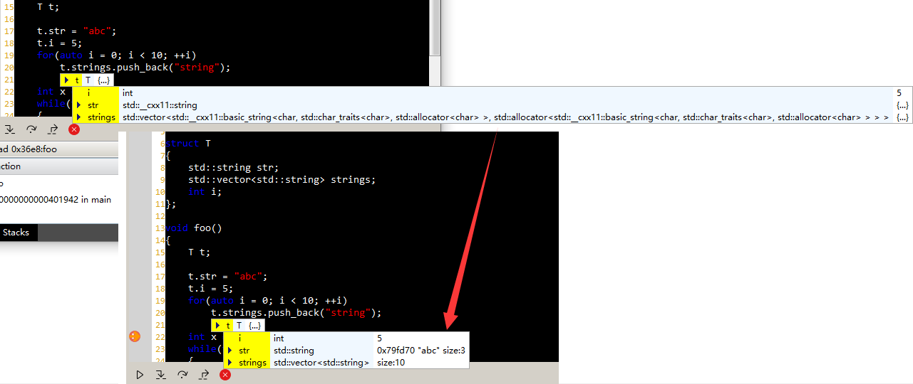

Specifications and Plan
==============

Content
---

- User Interface
    - Tabbar
    - Main Toolbar
        - Navigating button
        - Undo & Redo
        - Start to Debug
    - Project View
        - Source code tree view
        - Project configuration
    - Debugging View
        - Operations
        - Thread Picker
        - Call Stacks View
        - Variable Viewer
    - Codepad
        - Code Highlighting
        - Line Number Viewer
        - Operations bar

- Runner
    - Debugging
        - [Refinement](#refinement)
            - [Rules](#rules)
                - [Refining Types](#refining-types)
                - [Refining Values](#refining-values)


# Runner

## Debugging

### Refinement

The refinement is to provide a way to interpret the information that is produced by debugger as a readable and understandable text. The variable viewer shows the understandable text when watching a variable during debugging.




#### Rules

The rule is a JSON file that specifies how a variable is interpreted with its type, value and elements. It contains 2 types of parts.

```JSON
{
    "match":{
        "a-type-name":{}
    },
    "regex_match":{
        "a-type-name":{}
    }
}
```


The `match` part defines names that are matched using simple string compare. While the `regex_match` part defines names that are matched using regular expression.

##### Refining Types
```JSON
{
    "match":{
        "std::__cxx11::string":{
            "alias":"std::string"
        }
    }
}
```

It results `std::string` when a variable type is `std::__cxx11::string`. The refinement finds an alias repeatedly in `match` part until there is no one can be found. For example, following rule results `std::string` too.

```JSON
{
    "match":{
        "A":{
            "alias":"std::string"
        },
        "std::__cxx11::string":{
            "alias":"A"
        }
    }
}
```

When watch a `std::vector<std::string>` object's type using GDB, it prints `std::vector<std::__cxx11::basic_string<char, std::char_traits<char>, std::allocator<char> >, std::allocator<std::__cxx11::basic_string<char, std::char_traits<char>, std::allocator<char> > > >`

To refine it as `std::vector<std::string>`, use following rules.

```JSON
{
	"match": {
		"std::__cxx11::basic_string<char, std::char_traits<char>, std::allocator<char> >":{
			"alias": "std::string"
		}
	},
	"regex_match": {
		"std::vector<([\\s\\S]+)>": {
			"alias":"std::vector<$0>"
		}
	}
}
```

The long type name is matched by the rule defined in `regex_match` part. Its alias is `"std::vector<$0>"`, the `$0` stands for the first template parameter, value of the `$0` is `std::__cxx11::basic_string<char, std::char_traits<char>, std::allocator<char> >`. Before the replacing the `$0` with the first template parameter, the refinement matches the first template parameter in `match` part and finds the alias for it. Finally, the long type name is refined as `std::vector<std::string>`.


##### Refining Values

```JSON
{
    "match":{
        "std::string":{
            "value":["._M_dataplus._M_p", " size:", "._M_string_length"]
        }
    }
}
```

`value` is an array, when an element starts with a `.`, it indicates the content is replaced with the specified member of the object. E.g. if a `std::string` is `"kunlun"`, the rule results the string `"0xf0f0f0 "kunlun" size: 6"`.

A call to debugger can be specified in `value`. The above rule can be written like this.
```JSON
{
    "match":{
        "std::string":{
            "value":["._M_dataplus._M_p", " size:", "#$.size()"]
        }
    }
}
```
An element starts with `#` indicates a call in debugger, `$` indicates the object currently being refined.